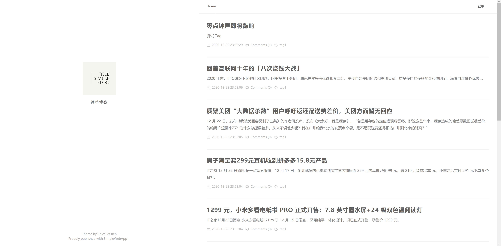
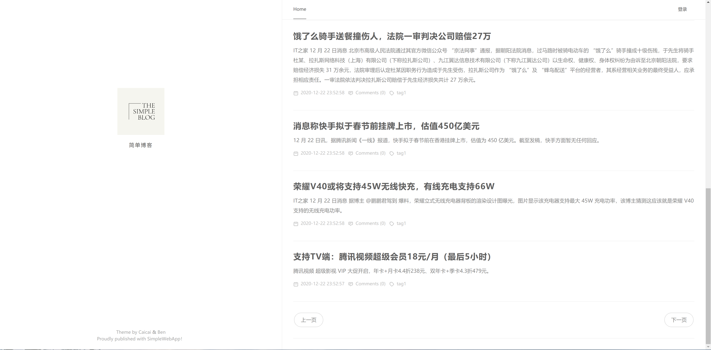
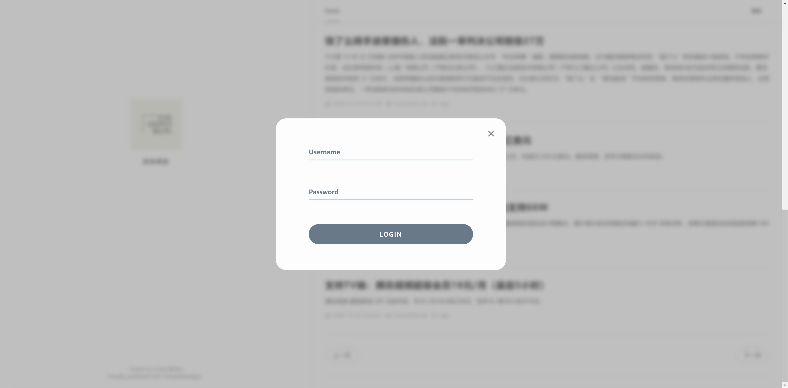
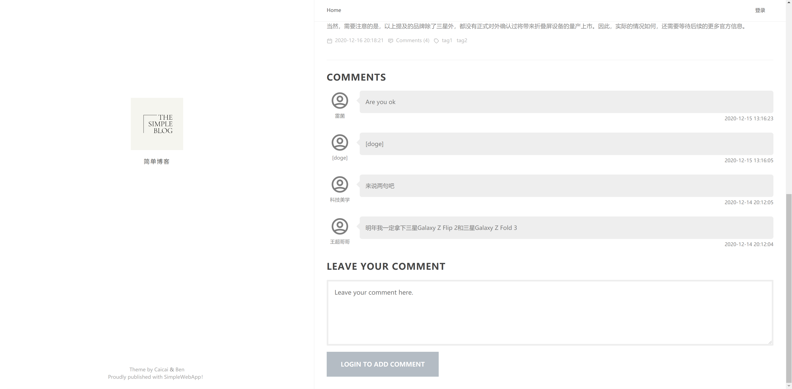
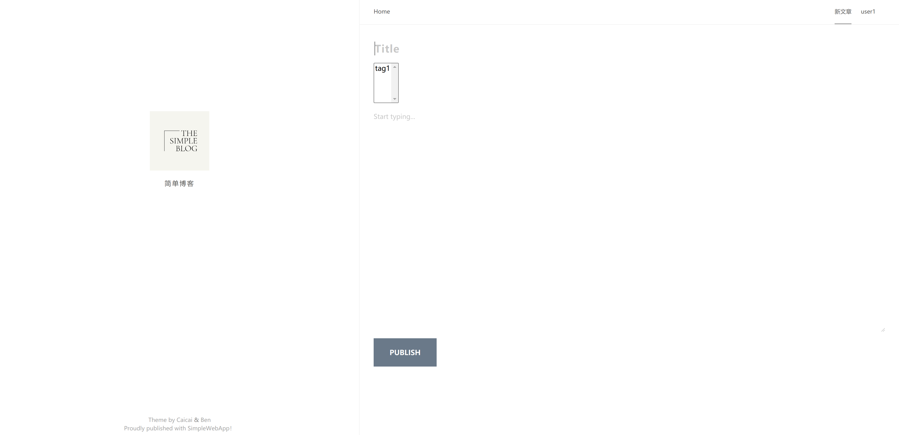

# A Simple Web Blog
本次的简单 web 服务与客户端开发实战，我们小组选择进行一个简单博客的制作。

## :movie_camera:项目简介

项目名称：A simple web blog

项目目标：

1. 选择合适的 API，实现从接口或资源（领域）建模，到 API 设计的过程
2. 使用 API 工具，编制 API 描述文件，编译生成服务器、客户端原型
3. 使用 GitHub [建立一个组织](https://chun-ge.github.io/How-to-establish-an-organization-on-Github/)，通过 API 文档，实现 客户端项目 与 RESTful 服务项目同步开发
4. 使用 API 设计工具提供 Mock 服务，两个团队独立测试 API
5. 使用 travis 测试相关模块

## :school:项目要求

| 项目要求                   | 本项目实现内容                                               |
| -------------------------- | ------------------------------------------------------------ |
| 开发周期                   | 2周                                                          |
| 每个项目仓库必须要有的文档 | 每个仓库都有README.md、LICENSE                               |
| 客户界面与美术             | 我们进行了相当丰富的页面设计，对于登录页面、文章样式、文章列表、评论样式有着自己的改进 |
| API设计                    | 我们按照Rest风格设计了我们的10个API，并且给出了详细的API文档 |
| 资源来源                   | 我们的数据部分来自于科技美学，部分来自于IT之家               |
| 服务器端数据库支持         | 本次项目采用了BoltDB，这是一个简单的KV数据库                 |
| 数据测试                   | 我们使用了Github Automated Tests对于我们的模块进行测试       |
| 页面数与 API 数限制        | 我们制作了多个页面以及10个API                                |
| API 要求                   | 访问[here](cahn233.cn:3333/api/)可以获取简单的API服务列表，同时我们文章列表支持分页 |
| 加分项                     | 我们的添加评论API支持token认证                               |

## :house:项目分工：

| 姓名 | 学号     | 分工说明                                                     |
| ---- | -------- | ------------------------------------------------------------ |
| 鲁睿 | 18342067 | API设计，后端用户登录、添加文章以及标签的相关API实现，以及对于API的test |
| 南樟 | 18342077 | API设计，后端文章初始API以及评论相关API实现，项目文档的编写  |
| 王超 | 18342090 | API设计，前端所有内容的开发，对于自动爬取数据的编写，GitHub automated tests |

## :speedboat:个人报告

- [18342067 鲁睿](./md/18342067.md)
- [18342077 南樟](./md/18342077.md)
- [18342090 王超](./md/18342090.md)

## :fuelpump:仓库说明

`Documents`存放了本次项目的API，API文档以及项目文档和个人报告

`Server`存放了本次项目的服务端内容

`Frontend`存放了本次项目的客户端内容

`simple-web-app.github.io`存放了项目API文档的GitHub Page

`Seed`存放了本次项目自动爬取数据的js

## :rocket:API：

- Sign in
- Get Articles
- Get Article By Id
- Delete Article
- Get Comments
- Create Comment
- Add Article
- Add Tag
- Get Tags
- Get Tag By Id


## :key:API文档：

- [点击这里](https://simple-web-app.github.io/)

## :zap:Quick Start

#### 前端部分

**Project setup**

```
yarn install
```

**Compiles and hot-reloads for development**

```
yarn serve
```

**Compiles and minifies for production**

```
yarn build
```

**Lints and fixes files**

```
yarn lint
```

**Customize configuration**

See [Configuration Reference](https://cli.vuejs.org/config/)

#### 后端部分Choose1

对于后端部分，使用以下命令进行安装

```
go get -u https://github.com/simple-web-app/Server/tree/main/go
```

然后在相应文件中进行import

```
import(
	sw "github.com/simple-web-app/Server/tree/main/go"
)
```

在main.go的main函数中添加以下代码即可运行，即可在localhost:8080端口接收到我们API的相关信息

```
	sw.CreateUser()
	sw.CreateTable()
	sw.CreateComments()
	sw.CreateTag()
	router := sw.NewRouter()

	log.Fatal(http.ListenAndServe(":8080", router))
```

#### :heart:后段部分Choose2

你也可以选择我们提供服务的在线API

```
cahn233.cn:3333/api/
```

## :camera:前端设计

**文章列表：**



**分页设计：**

我们对于每一页能够显示的文章数进行了规定，每一页最多能够显示10篇文章，并且文章的顺序是按照发布时间逆序排列，这样就可以在列表最前端看到最新发布的文章，

在文章列表的最下端，我们可以选择上一页以及下一页。



**用户登录：**

在 Home page 的右上角我们可以选择登录，登录接口使用了jwt产生token。Username 和 Password 会根据是否被选中而放大或缩小；点击按钮后按钮会进行动画，根据是否匹配而呈现不同的样式。



**文章内容：**

点击其中的一个文章标题可以进入文章具体内容


**文章评论：**

在登录后，在每一篇文章的详情页下，我们可以根据之前登录的账号发表评论，发评论的过程中运用了之前 jwt 产生的 token 。同时评论的顺序也是按照时间逆序排列的。



**添加文章：**

在登录后，我们可以在用户名边上选择添加新文章。文章需要提供标题和内容，每个文章可以从数据库中选择 tag ，tag 可以多选。



## :computer:后端设计

后端使用了swagger进行了API文档的设计。


文档的具体代码如下所示：

```yaml
---
swagger: "2.0"
info:
  description: "Simple Web Blog"
  version: "1.0.0"
  title: "simple web blog"
  termsOfService: "https://swagger.io/terms/"
  contact:
    email: "nanzh@mail2.sysu.edu.cn"
  license:
    name: "Apache 2.0"
    url: "http://www.apache.org/licenses/LICENSE-2.0.html"
host: "virtserver.swaggerhub.com"
basePath: "/serviece/Test/1.0.0"
tags:
- name: "article"
  description: "The all things maybe use with article"
- name: "user"
  description: "The way to operate by users"
schemes:
- "https"
paths:
  /user/signin:
    get:
      tags:
      - "user"
      summary: "sign in"
      description: "Check the username and password"
      operationId: "SignIn"
      produces:
      - "application/json"
      parameters:
      - in: "body"
        name: "body"
        required: true
        schema:
          $ref: "#/definitions/User"
        x-exportParamName: "Body"
      responses:
        "200":
          description: "Success Sign In"
          schema:
            $ref: "#/definitions/response_200"
        "404":
          description: "Not Found"
          schema:
            $ref: "#/definitions/response_404"
  /articles:
    get:
      tags:
      - "article"
      summary: "Get New Articles"
      description: "Get the articles' titles"
      operationId: "GetArticles"
      produces:
      - "application/json"
      parameters:
      - name: "page"
        in: "query"
        description: "the request pages"
        required: true
        type: "string"
        x-exportParamName: "Page"
      responses:
        "200":
          description: "Successful"
          schema:
            $ref: "#/definitions/ArticlesResponse"
        "404":
          description: "Not found"
          schema:
            $ref: "#/definitions/response_404"
  /article/{id}:
    get:
      tags:
      - "article"
      summary: "The detail of articles"
      description: "Get Aritles' details"
      operationId: "GetArticleById"
      produces:
      - "application/json"
      parameters:
      - name: "id"
        in: "path"
        description: "The ID of the article"
        required: true
        type: "integer"
        x-exportParamName: "Id"
      responses:
        "200":
          description: "Success"
          schema:
            $ref: "#/definitions/Article"
        "400":
          description: "Bad Request"
          schema:
            $ref: "#/definitions/response_400"
        "404":
          description: "Not Found"
          schema:
            $ref: "#/definitions/response_404"
    delete:
      tags:
        - "article"
      summary: "Delete article by id"
      description: "Delete an article"
      operationId: "DeleteArticleById"
      produces:
        - "application/json"
      parameters:
        - name: "id"
          in: "path"
          description: "The ID of the article"
          required: true
          type: "integer"
          x-exportParaName: "Id"
          x-exportParamName: "Id"
      responses:
        "200":
          description: "Success"
        "404":
          description: "Not Found"
  /article:
    post:
      tags:
        - "article"
      summary: "Add a article at last"
      description: "Add a article"
      operationId: "AddArticle"
      parameters:
        - in: "body"
          name: "Article"
          required: true
          schema:
            $ref: "#/definitions/Article"
          x-exportParaName: "Article"
          x-exportParamName: "Article"
      responses:
        "200":
          description: "Successful"
          schema:
            $ref: "#/definitions/Article"
        "400":
          description: "Bad Request"
          schema:
            $ref: "#/definitions/response_400"
  /article/{id}/comments:
    get:
      tags:
      - "comment"
      summary: "Get the comments of the article"
      description: "Get the comments of the article"
      operationId: "GetCommentsOfArticle"
      produces:
      - "application/json"
      parameters:
      - name: "id"
        in: "path"
        description: "The ID of the article"
        required: true
        type: "integer"
        x-exportParaName: "Id"
        x-exportParamName: "Id"
      responses:
        "200":
          description: "Success"
          schema:
            $ref: "#/definitions/Comments"
        "400":
          description: "Bad Request"
          schema:
            $ref: "#/definitions/response_400"
        "404":
          description: "Not Found"
          schema:
            $ref: "#/definitions/response_404"
    post:
      tags:
      - "comments"
      summary: "Create a new comment"
      description: "Create a new comment"
      operationId: "CreateComment"
      parameters:
      - name: "id"
        in: "path"
        description: "The ID of the article"
        required: true
        type: "integer"
        x-exportParaName: "Id"
        x-exportParamName: "Id"
      - in: "body"
        name: "body"
        required: true
        schema:
          $ref: "#/definitions/body"
        x-exportParaName: "Body"
        x-exportParamName: "Body"
      responses:
        "200":
          description: "Successful"
          schema:
            $ref: "#/definitions/Comment"
        "400":
          description: "Bad Request"
          schema:
            $ref: "#/definitions/response_400"

  /tag/{id}:
    get:
      tags:
        - "tag"
      summary: "The tag"
      description: "Get tag"
      operationId: "GetTagById"
      produces:
        - "application/json"
      parameters:
        - name: "id"
          in: "path"
          description: "The ID of the tag"
          required: true
          type: "integer"
          x-exportParamName: "Id"
      responses:
        "200":
          description: "Success"
          schema:
            $ref: "#/definitions/Tag"
        "400":
          description: "Bad Request"
          schema:
            $ref: "#/definitions/response_400"
        "404":
          description: "Not Found"
          schema:
            $ref: "#/definitions/response_404"

  /tag:
    get:
      tags:
        - "tag"
      summary: "The tag"
      description: "Get tags"
      operationId: "GetTags"
      produces:
        - "application/json"
      parameters:
        - in: "body"
          name: "Tag"
          required: true
          schema:
            $ref: "#/definitions/Tag"
          x-exportParaName: "Tag"
          x-exportParamName: "Tag"
      responses:
        "200":
          description: "Success"
          schema:
            $ref: "#/definitions/Tag"
        "400":
          description: "Bad Request"
          schema:
            $ref: "#/definitions/response_400"
        "404":
          description: "Not Found"
          schema:
            $ref: "#/definitions/response_404"
    post:
      tags:
        - "tag"
      summary: "Add a tag at last"
      description: "Add a tag"
      operationId: "AddTag"
      parameters:
        - in: "body"
          name: "Tag"
          required: true
          schema:
            $ref: "#/definitions/Tag"
          x-exportParaName: "Tag"
          x-exportParamName: "Tag"
      responses:
        "200":
           description: "Successful"
           schema:
             $ref: "#/definitions/Tag"
        "400":
           description: "Bad Request"
           schema:
             $ref: "#/definitions/response_400"
definitions:
  User:
    type: "object"
    required:
    - "password"
    - "username"
    properties:
      username:
        type: "string"
      password:
        type: "string"
    example:
      password: "password"
      username: "username"
  Tag:
    type: "object"
    required:
      - "name"
    properties:
      name:
        type: "string"
    example:
      name: "name"
  Article:
    type: "object"
    required:
    - "content"
    - "id"
    - "name"
    properties:
      id:
        type: "integer"
      name:
        type: "string"
      tags:
        type: "array"
        items:
          $ref: "#/definitions/Tag"
      date:
        type: "string"
      content:
        type: "string"
    example:
      date: "date"
      author: "author"
      name: "name"
      id: 0
      content: "content"
      tags:
      - name: "name"
      - name: "name"
  ArticleResponse:
    properties:
      id:
        type: "integer"
      name:
        type: "string"
    example:
      name: "name"
      id: 0
  ArticlesResponse:
    properties:
      Articles:
        type: "array"
        items:
          $ref: "#/definitions/ArticleResponse"
    example:
      Articles:
      - name: "name"
        id: 0
      - name: "name"
        id: 0
  Comment:
    type: "object"
    required:
    - "articleId"
    - "author"
    - "content"
    - "date"
    properties:
      date:
        type: "string"
      content:
        type: "string"
      author:
        type: "string"
      articleId:
        type: "integer"
    example:
      date: "date"
      author: "author"
      articleId: 0
      content: "content"
  Comments:
    properties:
      contents:
        type: "array"
        items:
          $ref: "#/definitions/Comment"
    example:
      contents:
      - date: "date"
        author: "author"
        articleId: 0
        content: "content"
      - date: "date"
        author: "author"
        articleId: 0
        content: "content"
  body:
    type: "object"
    properties:
      content:
        type: "string"
      author:
        type: "string"
  response_200:
    type: "object"
    properties:
      token:
        type: "string"
    example:
      token: "token"
  response_400:
    type: "object"
    properties:
      error:
        type: "string"
        example: ""
  response_404:
    type: "object"
    properties:
      error:
        type: "string"
        example: ""

```

对于服务端的建立，后端使用了 `gorilla/mux`  库来搭建自己的服务端。

通过一下简单的代码来建立起路由以及监听8080端口。

```go
	router := sw.NewRouter()

	log.Fatal(http.ListenAndServe(":8080", router))
```

本次实验我们使用了boltDB，是一个简单的KV数据库。

利用以下的代码可以简单的连接到本地数据库。

```go
	db, err := bolt.Open("my.db", 0600, nil)
		if err != nil {
			log.Fatal(err)
		}
	defer db.Close()
```

这次后端提供了如下的API

- Sign in
- Get Articles
- Get Article By Id
- Delete Article
- Get Comments
- Create Comment
- Add Article
- Add Tag
- Get Tags
- Get Tag By Id

关于API的设计以及具体内容可以参考 [Server](https://github.com/simple-web-app/Server) 以及 [API doc](https://simple-web-app.github.io/) 。

关于API的Test，我们使用了 github 的 automated tests 来代替 travis 对于相应模块进行测试，同时我们还编写了相应的测试文件以及[测试文档](https://github.com/simple-web-app/Server/blob/main/api_test.md)。