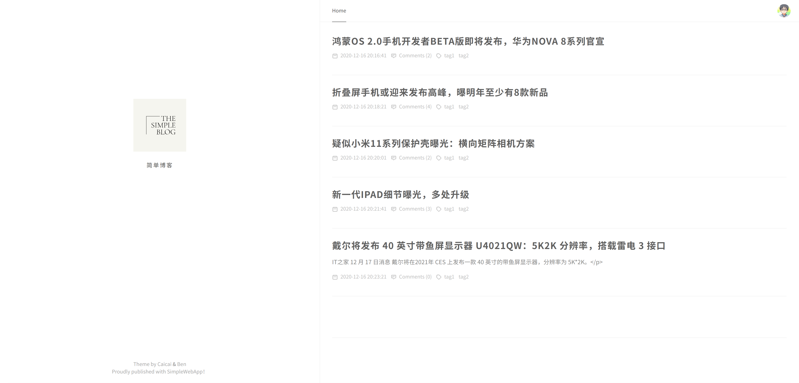
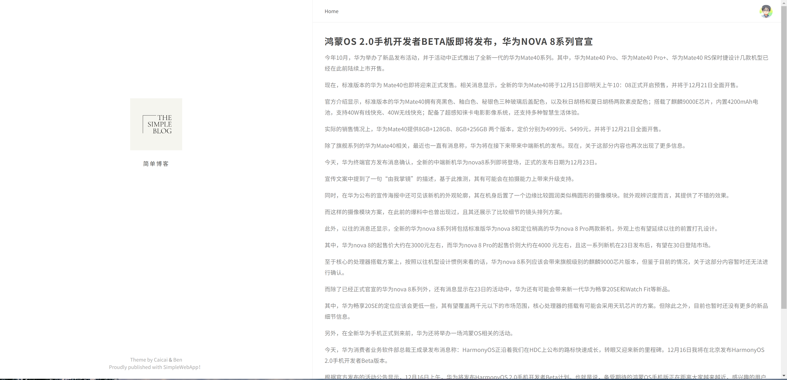

# A Simple Web Blog
本次的简单 web 服务与客户端开发实战，我们小组选择进行一个简单博客的制作。

## 项目简介

项目名称：A simple web blog

项目目标：

1. 选择合适的 API，实现从接口或资源（领域）建模，到 API 设计的过程
2. 使用 API 工具，编制 API 描述文件，编译生成服务器、客户端原型
3. 使用 GitHub [建立一个组织](https://chun-ge.github.io/How-to-establish-an-organization-on-Github/)，通过 API 文档，实现 客户端项目 与 RESTful 服务项目同步开发
4. 使用 API 设计工具提供 Mock 服务，两个团队独立测试 API
5. 使用 travis 测试相关模块

## 项目要求

| 项目要求                   | 本项目实现内容                                               |
| -------------------------- | ------------------------------------------------------------ |
| 开发周期                   | 2周                                                          |
| 每个项目仓库必须要有的文档 | 每个仓库都有README.md、LICENSE                               |
| 客户界面与美术             | 我们进行了简单的页面设计                                     |
| API设计                    | 我们按照Rest风格设计了我们的10个API，并且给出了详细的API文档 |
| 资源来源                   | 我们的数据部分来自于科技美学，部分来自于IT之家               |
| 服务器端数据库支持         | 本次项目采用了BoltDB，这是一个简单的KV数据库                 |
| 页面数与 API 数限制        | 我们制作了多个页面以及10个API                                |
| API 要求                   | 访问[here](cahn233.cn:3333/api/)可以获取简单的API服务列表，同时我们文章列表和评论列表支持分页 |
| 加分项                     | 我们的添加评论API支持token认证                               |

## 项目分工：

| 姓名 | 学号     | 分工说明                                                     |
| ---- | -------- | ------------------------------------------------------------ |
| 鲁睿 | 18342067 | API设计，后端用户登录、添加文章以及标签的相关API实现，以及对于API的test |
| 南樟 | 18342077 | API设计，后端文章初始API以及评论相关API实现，项目文档的编写  |
| 王超 | 18342090 | API设计，前端所有内容的开发，对于自动爬取数据的编写，GitHub automated tests |

## 个人报告

- [18342067 鲁睿](./md/18342067.md)
- [18342077 南樟](./md/18342077.md)
- [18342090 王超]()

## 仓库说明

`Documents`存放了本次项目的API，API文档以及项目文档和个人报告

`Server`存放了本次项目的服务端内容

`Frontend`存放了本次项目的客户端内容

`simple-web-app.github.io`存放了项目API文档的GitHub Page

`Seed`存放了本次项目自动爬取数据的js

## API：

- Sign in
- Get Articles
- Get Article By Id
- Delete Article
- Get Comments
- Create Comment
- Add Article
- Add Tag
- Get Tags
- Get Tag By Id


## API文档：

- [点击这里](https://simple-web-app.github.io/)

## :zap:Quick Start

#### 前端部分

**Project setup**

```
yarn install
```

**Compiles and hot-reloads for development**

```
yarn serve
```

**Compiles and minifies for production**

```
yarn build
```

**Lints and fixes files**

```
yarn lint
```

**Customize configuration**

See [Configuration Reference](https://cli.vuejs.org/config/)

#### 后端部分Choose1

对于后端部分，使用以下命令进行安装

```
go get -u https://github.com/simple-web-app/Server/tree/main/go
```

然后在相应文件中进行import

```
import(
	sw "github.com/simple-web-app/Server/tree/main/go"
)
```

在main.go的main函数中添加以下代码即可运行，即可在localhost:8080端口接收到我们API的相关信息

```
	sw.CreateUser()
	sw.CreateTable()
	sw.CreateComments()
	router := sw.NewRouter()

	log.Fatal(http.ListenAndServe(":8080", router))
```

#### 后段部分Choose2

你也可以选择我们提供服务的在线API

```
cahn233.cn:3333/api/
```

## 前端设计

**文章列表：**



点击其中的一个文章标题可以进入文章具体内容

**文章内容：**

