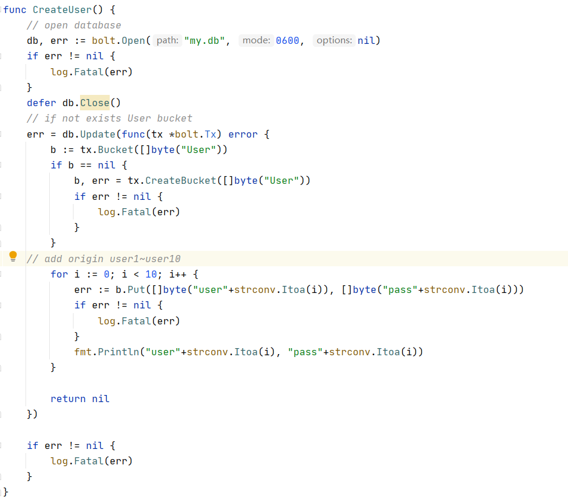

## 项目小结

这次的项目我是分配到后端进行API的设计以及相关功能的实现。

起初我们确定了6个需要完成的API（后来我们又增加了一些API），然后我负责其中关于article、comments相关功能的实现以及初始数据的加载。

首先我们先是对于我们需要的API进行了讨论，在讨论之后使用了swagger进行了API文档的设计

创建了API

API的具体内容

然后在本项目中，我主要实现以下的几个API

其中某个API的具体内容

### 初始数据加载：

- user：

    User Model:

    每一个User拥有两个属性，Username以及Password

      

    User init:

    创建初始用户user1\~user10

    初始密码设置为pass1\~pass10

      

- article：

    Article Model:

    每个Article拥有5个属性

    ArticleId：就是每个Article在数据库中的编号

    name： Article的标题

    Tags： Article的标签，一个Article可以拥有多个标签

    Date： Article创建的时间

    Content： Article的内容

    

    Article init:

    假如Article不存在，则从本地加载local的数据

    

- comments：

    Comment Model:

    每个Comment拥有4个属性：

    Date： Comment创建的时间

    Content： Comment的内容

    Author： Comment的发起者

    ArticleId： Comment对应的ArticleId

    

    Comment init:

    

### api具体实现：

- Get Articles：

    对于database里面Article桶的检索，将Article按照10个为一页进行分页

      

- Get Article By Id：

    通过对于database中Article桶的检索，将对应Id的Article进行json反序列化并返回

      

- Delete Article：

    通过对于database中Article桶的检索，将对应Id的Article删除

      

- Get Comments：

    通过对于database中Comment桶的检索，将对应Id的Article中的所有Comment按照一页5个进行返回

      

- Create Comment：

    通过对于database中Comment桶的检索，在对应Id的Article中创建新的Comment

    

### API调用结果：

- Get Articles

    

- Get Articles By Id

    

- Delete Articles By Id

    

- Get Comments

- 

- Create Comment

    

### 过程中遇到的一些Bug：

- 首先在写api_test.md的时候，按照本地渲染的md是正常的，但是传到github之后"~"就会被github渲染成删除线，后来尝试使用latex进行输入，发现github并不能渲染，最后尝试加反斜杠，难得成功。
- 一开始我是先使用comments部分的api，初步完成后调用发现失败了，经过调查发现是我数据库中查询不到文章，从而使得查找不到对应的文章从而报错。之后完善了文章部分的api，在数据库中添加了文章后，comments部分的api就可以使用了。
- 添加Comment的时候需要在区块头添加token，一开始不知道token如何添加，导致这一块在写api_test.md的时候相当困难。然后在不断学习过程中知道了应该在区块头添加token，这样就可以使得CreateComment调用成功。然后被前端同学提出不需要用用户名进行加密，并且需要在token中加入用户名，从而使得在创建评论时不需要提供用户名。听从了前端的意见，我就对token进行了修改，来满足前端的需求。token中也加入了时间作为参数，保证token是多样的，从而使得破译变得困难。
- 在队友测试添加文章api时，发现了我原本写的逻辑是存在问题的，原本是通过文章的编号来从本地读取已有的评论，但是通过api添加的文章初始是没有评论的，但是我原本的版本会从对应的本地路径寻找评论，从而报错。后来完善了相应的功能。

### 总结

整个实验过程中，我们从最初的懵懂无知，比较难以理解前后端如何分离进行工作，到中间的努力学习，到最后的项目完成。很感谢整个小组的辛苦付出。由于我们小组仅有3个人，所以每个人的工作量都是其他小组的两倍，显得压力格外得大。不过所幸的是我们三个都在同一个宿舍，所以沟通交流起来是相当方便的，有问题直接在群里@对应的人就可以快速地得到解答。

在整个的学习过程中，也许之前的框架只是让我能够勉强套用别人的框架，现在这个项目的完成让我能够熟练地运用这些框架从而完成一个后端应有的功能。同时swagger的使用使得整个项目的进展迅速，这间接反映了一个好的工具相对比起很多复杂且重复的文字是更加有效的。前后端分离的确让整个项目推进得更快了一些，这也是我们需要学习的。

同时我也学到了文档的重要性，由于别人理解你的代码的时间是极其有限的，所以为了能够帮助别人更快地理解，一份好的文档是必不可少的。在组员的建议下，我一开始对于api的test进行了描述，然后api文档由swagger帮助生成。这让另一位后端同学在写test文件时能够更快地了解到自己需要测试什么。

