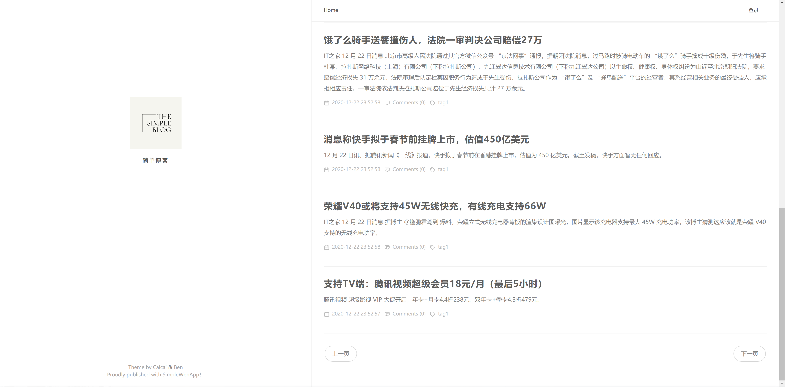
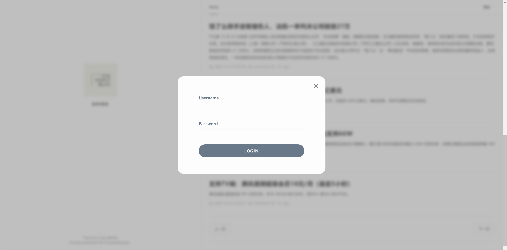
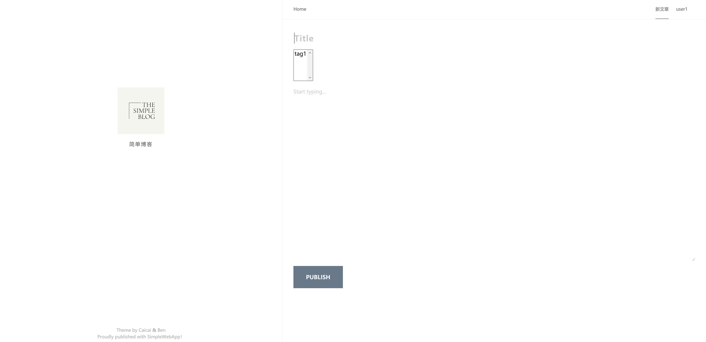
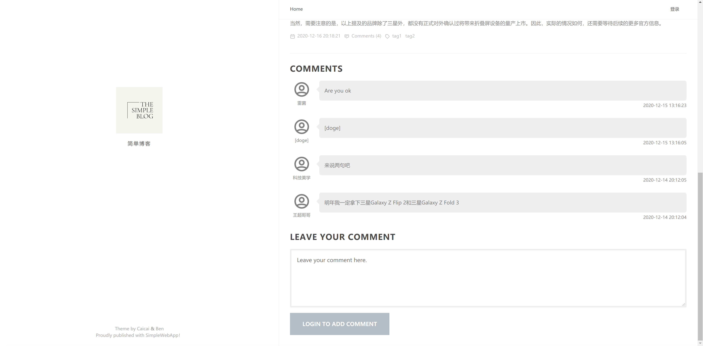

## 项目总结

### 前端

本次尝试使用 Vue 3 作为 SPA 框架，结合 Composition API 总体使用下来感觉良好，唯一的问题就是生态系统还相对欠缺。

前端包括一个首页（文章列表，支持分页），文章详情页（含评论区、添加评论），新文章页与登录弹框。由于 Vue 3 可用的 UI 库较少（或者说适合前台的 UI 库较少），本次未使用任何 UI 库，而是总体基于一个成熟的博客主题 Anatole（详见 Acknowledgements）。博客主题未提供的部分（如输入控件、评论样式等）则使用其他的解决方案，并加以改造。

当登录后，用户可以发布新文章，或为既有文章添加评论。

我们借助 Vue Router 的强大路由能力简单设置了 SPA 的路由，并为特权页面（如新文章页）设置了路由守卫。

### Mock

我们借助 Swagger 自带的 Mock 功能，使得前端与后端在 API 定义完成后即可并行开发。当后端 API 基本可用时，我们通过编辑 webpack 的 devServer 的 proxy 相关配置即可简单切换后端，无需编辑应用代码。

### CI 自动化测试

我们本次没有使用 Travis CI， 而是使用了与 GitHub 集成度更高的 GitHub Actions 设置了后端代码的 automated tests。具体的配置可见 workflow 的 definition yaml：[.github/workflows/go.yml](https://github.com/simple-web-app/Server/blob/main/.github/workflows/go.yml)。每当有新的代码 push 到 GitHub 远端时，GitHub Actions 会执行该 workflow 定义的步骤，例如进行 `go test`。Workflow 运行的结果可在 commits 列表中看到。

### 真实数据导入

为了导入真实数据，我们撰写了一个[简单的 Node.js 脚本](https://github.com/simple-web-app/Seed)从 IT 之家提供的 RSS 源抓取最新的若干条新闻。同时为了解决图片防盗链问题，脚本同时下载原载于 IT 之家图床的图片后上传到自有腾讯云 COS。

## 功能截图

## Acknowledgements

前端项目使用了部分开源项目的代码与部分免费服务，在此表示感谢。

- 侧边栏 Logo 使用 [Canva](https://www.canva.com) 生成。
- 页面主题来自 [Caicai](https://www.caicai.me/) 为 Farbox 制作的 Anatole 主题与其移植到 Hexo 平台上的版本（developed by [Ben](https://github.com/Ben02/hexo-theme-Anatole)），根据 MIT License 授权。
- 登录页文本框样式来自 Tympanus Codrops 分享的 [Text Input Effects](https://tympanus.net/Development/TextInputEffects/index2.html)。
- 评论区气泡样式来自 [Bubbly](https://projects.verou.me/bubbly/)。
- 界面中的部分 SVG 图标来自 [Heroicons](https://heroicons.dev/)，根据 MIT License 授权。
